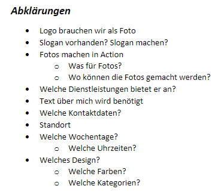

+++
title = "Weiteres Vorgehen"
date = "2021-09-21"
draft = false
pinned = false
image = "word.png"
description = "An diesem Tag haben wir verschiedene Abklärungen getroffen und die Interview fragen zusammengestellt."
+++
Da wir nicht alle Informationen zu Heinz Kohle haben, müssen wir mit ihm diese offenen Fragen noch abklären. Das Samira und ich aber nicht planlos an das Gespräch gehen, haben wir zuerst geschaut welche wichtigen Informationen uns noch fehlen. Wir haben diese in ein Wort Dokument geschrieben (Sehe Bild). Zur Gestaltung der Webseite haben wir aber nichts geschrieben es geht bei den Fragen mehr darum, ob er beispielsweise ein Logo hat, dass wir verwenden dürfen oder ein Slogan. Oder welche Dienstleistungen er genau anbieten. An der Powerpoint haben wir noch die letzten feinschliffe vorgenommen und sie fertig gestellt. Jetz müssen wir unbedingt einen Termin mit Herr Kohler vereinbaren damit wir das Interview machen können und danach mit allen Infos in die Arbeit "Webseite" hineinstürzten.

